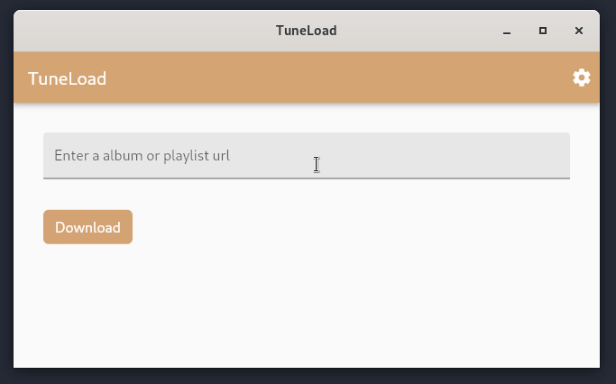
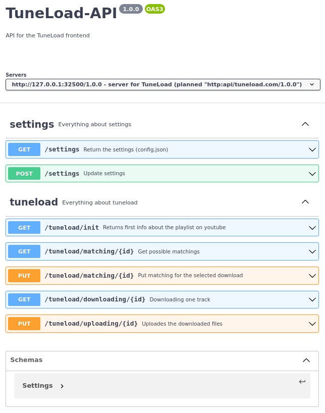

# TuneLoad - Frontend

Flutter frontend for downloading free album and playlists (based on a YouTube URL) and uploading them to a Plex server.

(The project is currently in progress. There are some additional features and ideas I want to implement.)

## Overview

TuneLoad is a Flutter-Client for a backend API that downloads a YouTube-Playlist of an album and upload it to a configured Plex Server.

## Definition of the Backend-API

A swagger definition of the Backend-API can be found in [./doc/apidoc.yml](./doc/apidoc.yml).

